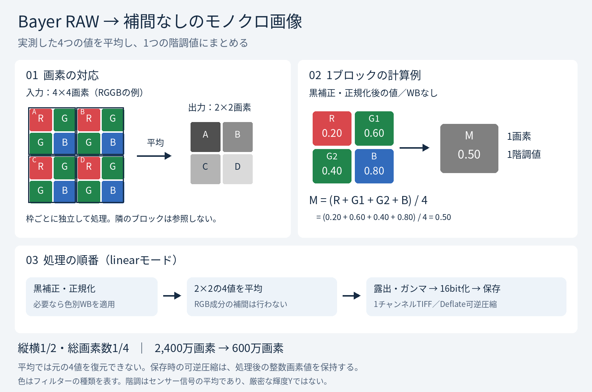

# raw_to_mono_no_demosaic

デジタルカメラのBayer RAWから、デモザイクせずにモノクロTIFFを生成するPythonスクリプトです。
隣接する **2×2画素（R・G・G・B）を1画素に平均**するため、縦横は半分、総画素数は1/4になります。

| 入力RAWの可視領域 | 出力TIFF | 画素数 |
| --- | --- | --- |
| 6,000×4,000 | 3,000×2,000 | 2,400万 → 600万 |
| 8,000×6,000 | 4,000×3,000 | 4,800万 → 1,200万 |

## 特徴

- RGB画像を現像せず、RAWのセンサー値を直接使用。
- 2×2ブロックの平均だけで縮小。デモザイクや追加の平滑化なし。
- 出力は16bit整数・1チャンネルのグレースケールTIFF。Deflateによる可逆圧縮。
- 黒レベル補正、正規化、カメラWB、露出補正、表示用ガンマに対応。
- 元RAWを変更せず、既存出力の上書きには `--force` が必要。

## 仕組みの図解



[拡大できるSVG版](docs/illustrations/bayer_to_mono.svg)

色付きのマスはカラーフィルターを表し、各画素が持つのはフィルターを通った光量の測定値です。
同じ2×2ブロックの4値を平均し、RGBの3値ではなく1つの階調値を作ります。
周囲の画素から欠けたRGB成分を推定する工程はありません。

図の数値例は黒補正・正規化後の値（WBなし）です。
`linear` モードでは黒補正・正規化、任意のWB、2×2平均、露出・ガンマ、16bit化の順に処理します。
`codes` モードでは補正を省き、RAWコード値を平均して整数に丸めます。

縦横は1/2、総画素数は1/4です。奇数寸法の末尾は切り捨てます。
平均は元の4値を復元できない処理です。TIFF保存時のDeflate圧縮は、処理後の整数画素値を完全に保持します。
これはセンサー信号の平均であり、測光的な輝度Yやモノクロ専用センサーの出力とは異なります。

## インストール

Python 3.12で動作確認しています。プロジェクトをダウンロードして、そのフォルダーで実行してください。

```bash
python -m venv .venv
```

| 環境 | 仮想環境の有効化 |
| --- | --- |
| Windows / PowerShell | `.venv\Scripts\Activate.ps1` |
| Windows / コマンドプロンプト | `.venv\Scripts\activate.bat` |
| macOS / Linux | `source .venv/bin/activate` |

```bash
python -m pip install -r requirements.txt
```

`requirements.txt` は動作確認したバージョンを固定しています。
機種の対応状況は、使用するrawpyとLibRawに依存します。

## 使い方

### Windowsの起動BAT

`raw_to_mono_no_demosaic.py.bat` に、1つまたは複数のRAWファイルをドラッグ＆ドロップできます。
Pythonスクリプト・BAT・`requirements.txt` は同じフォルダーに置いてください。

初回は専用の `.venv` を作成し、起動時に依存関係をインストールまたは確認します。Python 3.12の事前インストールと、依存関係取得のためのインターネット接続が必要です。
Python Launcherがあれば3.12を優先し、見つからなければ既定のPythonを使用します。
空白を含むパスや、BATと異なる作業フォルダーからの起動に対応するよう、スクリプトの場所を基準にしています。

各RAWの隣に線形TIFFを保存します。1つの変換が失敗しても後続を処理し、最後に失敗件数を表示して待機します。
既存出力は上書きしません。ガンマやWBを指定する場合は、以下のコマンドから実行してください。
Windows実機でのBAT動作は未検証です。

### 線形のモノクロTIFF

```bash
python raw_to_mono_no_demosaic.py photo.NEF
```

同じフォルダーに `photo_mono_linear.tif` を保存します。初期設定はWBなし・露出補正なし・線形出力です。
線形画像は、通常の画像ビューアーでは暗く見えることがあります。

### 表示用のガンマを適用

```bash
python raw_to_mono_no_demosaic.py photo.ARW -o mono.tif --gamma 2.2
```

ガンマはブロック平均の**後**に適用します。`--gamma 2.2` は簡易的なべき乗変換で、sRGBの厳密な変換ではありません。

### カメラWBと露出補正

```bash
python raw_to_mono_no_demosaic.py photo.CR2 -o mono_wb.tif --wb camera --exposure 1 --gamma 2.2
```

WBは平均する前に色ごとの倍率を掛けます。最大倍率を1に正規化するため、WB適用後は暗くなる場合があります。
`--exposure` はEV単位です。正の値で明るく、負の値で暗くします。出力範囲を超えた値はクリップされます。

### RAWコード値の平均を保存

```bash
python raw_to_mono_no_demosaic.py photo.NEF --mode codes
```

`photo_mono_codes.tif` に、黒レベル補正や正規化を行わない2×2平均値を保存します。
RAWのコード値域をそのまま使うため、16bit全域には拡大されません。通常表示より、数値の観察向けです。
このモードではWB・ガンマ・露出補正を併用できません。

## オプション一覧

| オプション | 初期値 | 内容 |
| --- | --- | --- |
| `input` | 必須 | 入力RAWファイル |
| `-o`, `--output` | 自動命名 | 出力先。`.tif` または `.tiff` |
| `--mode linear` | `linear` | 黒補正・正規化後の平均を16bitへ変換 |
| `--mode codes` | — | RAWコード値の平均を16bit整数へ丸める |
| `--wb none`, `--wb camera` | `none` | WBなし、またはカメラWB |
| `--exposure` | `0` | −32〜32 EVの露出補正 |
| `--gamma` | `1` | 正のガンマ値。1は線形 |
| `--force` | 無効 | 既存出力の上書きを許可 |
| `-h`, `--help` | — | 詳細なヘルプ |

## 処理の定義

`linear` モードでは、各センサー画素について色別の黒レベル `b` と飽和レベル `w` を使います。

```text
t = clip((RAW - b) / (w - b), 0, 1)
t_wb = t × WB倍率                    # WBなしでは倍率1
M = (R + G1 + G2 + B) / 4            # t_wbの重ならない2×2平均
E = clip(M × 2**exposure, 0, 1)
出力 = round(E**(1/gamma) × 65535)
```

`codes` モードでは、展開したRAWコード値の2×2平均を整数に丸めるだけです。
丸めはNumPyの最近接丸めを使い、ちょうど中間の値は偶数側へ丸めます。
RGGB・BGGR・GRBG・GBRGのRGB Bayer配列が対象です。画素の並び順によらず、4画素を同じ重みで平均します。

## 対応範囲と制約

| 対象 | 扱い |
| --- | --- |
| 2×2 RGB Bayer RAW | rawpy/LibRawが読み込めるものを処理 |
| FUJIFILM X-Trans RAW | 非対応。2×2にR・G・G・Bが揃わないため拒否 |
| Foveon・既にRGB化されたDNG | 非対応。3次元のRAWデータを拒否 |
| モノクロセンサーRAW・非RGB CFA | 非対応 |
| 奇数の幅・高さ | 右端1列・下端1行を必要に応じて切り捨て |
| 縦位置撮影 | センサー配列の向きで保存。自動回転なし |
| 入力メタデータ | EXIFやICCプロファイルは転記しない |

この画像の階調は**センサー信号の平均**です。厳密な測光的輝度Yや、カラーフィルターを持たないモノクロセンサーの出力とは異なります。
緑は2画素あるため、平均の重みは赤1/4・緑1/2・青1/4です。色のある被写体の明るさは、この感度と重みに影響されます。
デモザイクを省いても、エイリアシングやモアレが完全に消えるわけではありません。

黒レベル補正はrawpyが提供する色別の定数を使用し、行・列ごとの補正は行いません。
出力寸法はRAWの可視領域が基準なので、メーカー公称画素数や通常現像した画像の寸法と一致しない場合があります。

## 検証状況

Python 3.12、NumPy 2.3.5、rawpy 0.27.1、tifffile 2026.9.20で、合成Bayer DNGを使って以下を確認しています。

| 確認項目 | 結果 |
| --- | --- |
| RAWコードの読み出し | 入力コード値と一致 |
| 2×2平均と出力寸法 | 32×24 → 16×12。期待値と一致（正規化時は最大1階調の丸め差を許容） |
| TIFFの形式 | 16bit整数・1チャンネル |
| ガンマの適用順 | ブロック平均後に適用 |
| 露出補正・カメラWB | 合成RAWで処理完了 |
| 既存出力・入力の保護 | 無許可の上書きを拒否 |
| 実機RAW | 未検証 |

## 参照

- [rawpy API](https://letmaik.github.io/rawpy/api/rawpy.RawPy.html)
- [rawpy](https://github.com/letmaik/rawpy)
- [tifffile](https://github.com/cgohlke/tifffile)
